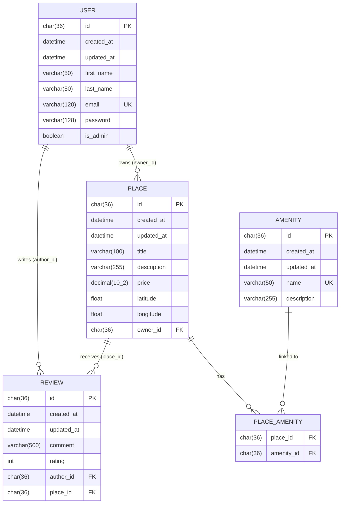
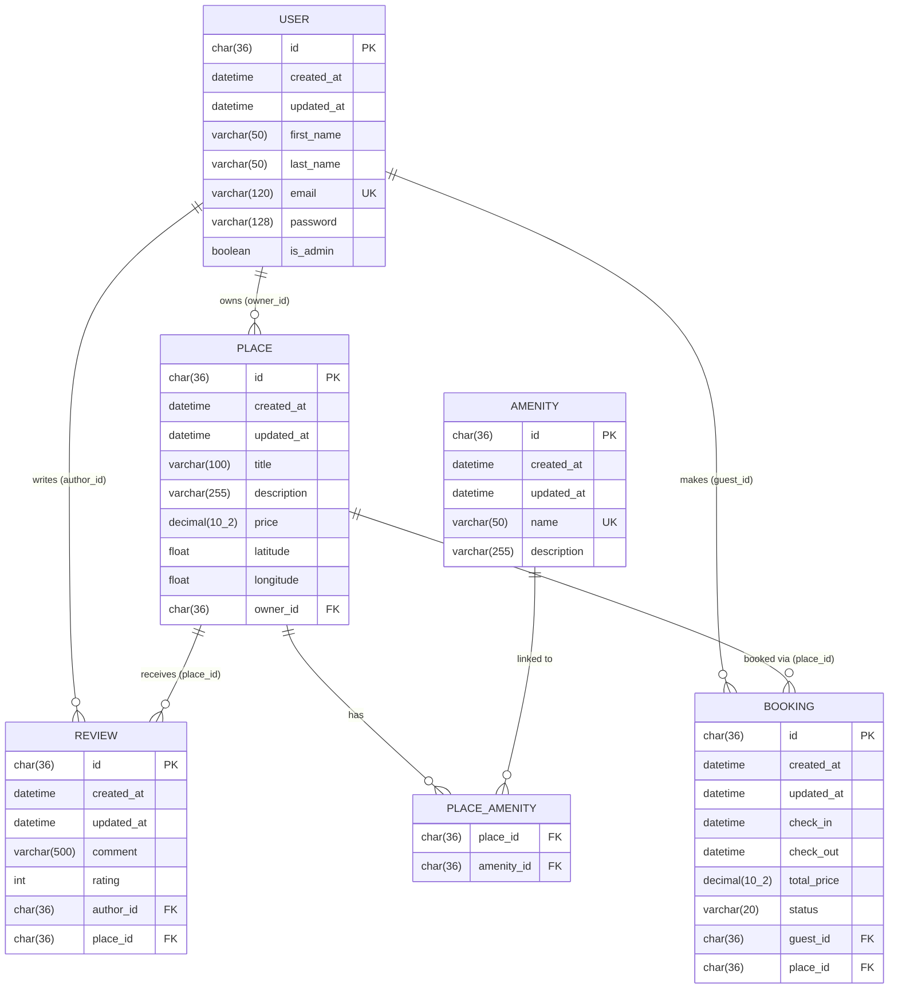

# HBnB Technical Documentation

---

# 1. Introduction

## 1.1 Project Overview

HBnB is a layered web application designed to manage users, places, reviews, and amenities.  
The system follows a structured architectural approach to ensure scalability, maintainability, and clear separation of responsibilities.

The application is built using a domain-driven design where core entities encapsulate business behavior, and API endpoints orchestrate interactions through clearly defined architectural layers.

---

## 1.2 Purpose of This Document

This document serves as a comprehensive technical blueprint for the HBnB project.

Its objectives are to:

- Present the overall system architecture  
- Describe the Business Logic domain model  
- Explain API interaction flows  
- Clarify architectural decisions and design rationale  
- Provide a reference for future implementation phases  

This document consolidates all diagrams and explanatory notes produced during the design phase.

---

# 2. High-Level Architecture

## 2.1 Layered Architecture Overview

The HBnB system follows a three-layer architecture:

- **Presentation Layer**
- **Business Logic Layer**
- **Persistence Layer**

Each layer has a clearly defined responsibility and communicates only with adjacent layers.

This design promotes modularity, testability, and maintainability.

```
flowchart LR
    PL["<b>Presentation Layer</b><br>
    <hr>
    API Endpoints<br> 
    Controllers
    (UserController, PlaceController, ReviewController, AmenityController)"] -. Facade Pattern .-> BL["<b>Business Logic Layer</b><br>
    <hr>
    Models (user, place, review, amenity)<br>
    Use cases (RegisterUser, CreatePlace, SubmitReview, SearchPlaces)"]
    BL -. Database Operations .-> DAL["<b>Persistence Layer</b><br>
    <hr>
    Repositories (UserRepo, PlaceRepo, ReviewRepo, AmenityRepo)<br>
    Database Access Object"]
```

---

## 2.2 Architectural Pattern: Facade

The system uses the **Facade Pattern** between the Presentation Layer and the Business Logic Layer.

The facade provides a simplified interface to the domain logic, preventing controllers from directly interacting with multiple internal components or domain entities.

### Design Rationale

The Facade pattern:

- Reduces coupling between layers  
- Centralizes business operations  
- Improves maintainability  
- Simplifies controller responsibilities  
- Ensures separation between HTTP handling and domain logic  

Controllers delegate operations to a unified entry point instead of directly manipulating domain models.

---

# 3. Business Logic Layer

## 3.1 Overview

The Business Logic Layer contains the core domain entities and business rules of the system.

It is responsible for:

- Defining domain behavior  
- Enforcing business constraints  
- Managing entity relationships  
- Orchestrating workflows  

This layer is independent from HTTP and database implementation details.

```
classDiagram
direction TB
    class BaseModel {
        <<abstract>>
	    #id: UUID4
	    #created_at: DateTime
	    #updated_at: DateTime
        +save() void
        +update_time() void
    }

    class User {
	    -first_name: str
	    -last_name: str
	    -email: str
	    -password: str
	    -is_admin: bool
	    +create_user(data: dict) User
	    +get_profile() dict
	    +update_user(data: dict) void
	    +set_password(password: str) void
	    +delete() void
    }

    class Place {
	    -title: str
	    -description: str
	    -price: float
	    -latitude: float
	    -longitude: float
	    -amenities: list[Amenity]
	    -owner_id: UUID4
	    +create_place(data: dict, owner_id: UUID4) Place
	    +get_details(): dict
		+to_list_item(): dict
	    +update_details(data: dict) void
	    +delete() void
	    +add_amenity(amenity: Amenity) void
        +remove_amenity(amenity: Amenity) void
    }

    class Review {
	    -rating: int
	    -comment: str
	    -author_id: UUID4
	    -place_id: UUID4
	    +create_review(data: dict, author_id: UUID4, place_id: UUID4) Review
	    +get_details() dict
	    +update_review(data: dict) void
	    +delete() void
    }

    class Amenity {
	    -name: str
	    -description: str
	    +create_amenity(data: dict) Amenity
	    +get_details() dict
	    +update_amenity(data: dict) void
	    +delete() void
    }
    BaseModel <|-- User
    BaseModel <|-- Place
    BaseModel <|-- Review
    BaseModel <|-- Amenity
    User "1" --> "0..*" Review
    User "1" --> "0..*" Place
    Place "1" *-- "0..*" Review
    Place "0..*" o-- "0..*" Amenity
```

---

## 3.2 Entity Descriptions

### BaseModel

`BaseModel` is an abstract class shared by all domain entities.

It provides:

- A unique identifier (UUID4)  
- Creation timestamp  
- Update timestamp  
- Generic persistence-related behavior  

The `update(data: dict)` method allows dynamic attribute modification while maintaining centralized lifecycle handling.

---

### User

The `User` entity represents a registered platform user.

A user can:

- Own multiple places  
- Submit multiple reviews  
- Update profile information  

The `is_admin` attribute enables role differentiation.

The entity encapsulates identity management and authentication-related logic.

---

### Place

The `Place` entity represents a property listing.

Each place:

- Is owned by one user (`owner_id`)  
- Can contain multiple reviews  
- Can include multiple amenities  

The entity provides methods for:

- Creating listings  
- Updating listing information  
- Managing amenity associations  
- Returning formatted data representations  

---

### Review

The `Review` entity represents feedback left by a user on a place.

Each review:

- Belongs to exactly one user (`author_id`)  
- Belongs to exactly one place (`place_id`)  
- Contains a rating and comment  

Reviews are strongly associated with places through composition.

---

### Amenity

The `Amenity` entity represents reusable features such as WiFi or parking.

Amenities:

- Exist independently of places  
- Can be linked to multiple places  
- Support a many-to-many relationship  

---

# 4. API Interaction Flow

This section describes how API requests travel through the layered architecture.

General pattern:

1. The USER sends an HTTP request.
2. The API validates the request.
3. The Business Logic applies domain rules.
4. The Persistence Layer performs data operations.
5. The response is returned to the USER.

---

## 4.1 User Registration – `POST /users`

### Purpose

Creates a new user account.

### Error Handling

- **400** – Invalid input  
- **409** – Email already exists  
- **500** – Database failure  

```
sequenceDiagram
    autonumber
    participant USER as USER
    participant API as API
    participant BL as BUSINESS LOGIC
    participant DB as DATABASE

    USER->>API: POST /users (registration data)
    API->>BL: validateRegistration(data)

    alt Invalid input (Presentation/API validation)
        BL-->>API: ValidationError
        API-->>USER: 400 Bad Request
    else Input valid
        BL->>DB: check_email(email)
        DB-->>BL: emailExists true/false

        alt Email already exists
            BL-->>API: EmailAlreadyExists
            API-->>USER: 409 Conflict
        else Email available
            BL->>DB: save_new_user(user)
            alt Database failure
                DB-->>BL: DatabaseError
                BL-->>API: PersistenceError
                API-->>USER: 500 Internal Server Error
            else Saved successfully
                DB-->>BL: UserSaved
                BL-->>API: UserCreated(user)
                API-->>USER: 201 Created
            end
        end
    end
```

---

## 4.2 Place Creation – `POST /places`

### Purpose

Creates a new place listing.

### Flow Summary

1. The API validates the input data.
2. The Business Logic verifies that the owner exists.
3. The Database saves the new place.
4. The API returns `201 Created`.

### Error Handling

- **400** – Invalid input  
- **404** – Owner not found  
- **500** – Database failure  

```
sequenceDiagram
    autonumber
    participant U as USER
    participant API as API
    participant BL as BUSINESS LOGIC
    participant DB as DATABASE

    U->>API: POST /places (place data)
    API->>BL: validatePlace(data)

    alt Invalid data
        BL-->>API: ValidationError
        API-->>U: 400 Bad Request
    else Valid data
        BL->>DB: check_owner(owner_id)
        DB-->>BL: ownerExists=true/false

        alt Owner not found
            BL-->>API: OwnerNotFound
            API-->>U: 404 Not Found
        else Owner exists
            BL->>DB: save_new_place(place)

            alt Database failur
                DB-->>BL: DatabaseError
                BL-->>API: PersistenceError
                API-->>U: 500 Internal Server Error
            else Saved successfully
                DB-->>BL: savedPlace
                BL-->>API: PlaceCreated(place)
                API-->>U: 201 Created
            end
        end
    end
```

---

## 4.3 Review Submission – `POST /places/{place_id}/reviews`

### Purpose

Allows a user to submit a review for a place.

### Flow Summary

1. The API validates the input.
2. The Business Logic verifies:
   - The user exists  
   - The place exists  
   - Permission rules are satisfied (e.g., booking requirement)  
3. The Database stores the review.
4. The API returns `201 Created`.

### Error Handling

- **400** – Invalid input  
- **404** – User or place not found  
- **403** – Permission denied  
- **500** – Database failure  

```
sequenceDiagram
    autonumber
    participant U as USER
    participant API as API
    participant BL as BUSINESS LOGIC
    participant DB as DATABASE

    U->>API: POST /places/{place_id}/reviews (review data)
    API->>BL: validateReview(data)

    alt Invalid data
        BL-->>API: ValidationError
        API-->>U: 400 Bad Request
    else Valid data
        BL->>DB: check_user(author_id)
        DB-->>BL: userExists=true/false

        alt User not found
            BL-->>API: UserNotFound
            API-->>U: 404 Not Found
        else User exists
            BL->>DB: check_place(place_id)
            DB-->>BL: placeExists=true/false

            alt Place not found
                BL-->>API: PlaceNotFound
                API-->>U: 404 Not Found
            else Place exists
                BL->>DB: check_permission(author_id, place_id)
                DB-->>BL: permission=true/false

                alt Permission denied
                    BL-->>API: PermissionDenied
                    API-->>U: 403 Forbidden
                else Allowed
                    BL->>DB: save_new_review(review)

                    alt Database failure
                        DB-->>BL: DatabaseError
                        BL-->>API: PersistenceError
                        API-->>U: 500 Internal Server Error
                    else Saved successfully
                        DB-->>BL: savedReview
                        BL-->>API: ReviewCreated(savedReview)
                        API-->>U: 201 Created
                    end
                end
            end
        end
    end
```

---

## 4.4 Fetching Places – `GET /places`

### Purpose

Retrieves a filtered list of places based on search criteria.

### Flow Summary

1. The API validates query parameters.
2. The Business Logic builds and validates search criteria.
3. The Database executes the search query.
4. The API returns `200 OK` with the result list.

### Error Handling

- **400** – Invalid filters  
- **422** – Business rule violation  
- **500** – Database failure  

```
sequenceDiagram
    autonumber  
    participant U as USER
    participant API as API
    participant BL as BUSINESS LOGIC
    participant DB as DATABASE

    U->>API: GET /places?lat=&lon=&max_price=&amenity=
    API->>BL: validateFilters(filters)

    alt Invalid filters
        BL-->>API: ValidationError
        API-->>U: 400 Bad Request
    else Valid filters
        BL->>BL: buildSearchCriteria(filters)

        opt lat & lon provided
            BL->>BL: computeGeoArea(lat, lon)
        end

        opt max_price provided
            BL->>BL: setMaxPrice(max_price)
        end

        opt amenity provided
            BL->>BL: addAmenityFilter(amenity)
        end

        BL->>BL: validateSearchCriteria(criteria)

        alt Business rule violation
            BL-->>API: InvalidSearchCriteria
            API-->>U: 422 Unprocessable Entity
        else Criteria accepted
            BL->>DB: search_places(criteria)

            alt Database failure
                DB-->>BL: DatabaseError
                BL-->>API: PersistenceError
                API-->>U: 500 Internal Server Error
            else Query success
                DB-->>BL: places[]
                BL-->>API: places[]
                API-->>U: 200 OK (places[])
            end
        end
    end
```

---

# 5. Database Schema

## 5.1 Overview

The HBnB database is structured around five tables that map directly to the domain entities defined in the Business Logic Layer. All tables share a common set of base fields (`id`, `created_at`, `updated_at`) inherited from `BaseModel`. Primary keys use `char(36)` UUIDs to avoid predictable identifiers and ensure portability across distributed systems.

---

## 5.2 Entity-Relationship Diagram — Current Schema

This diagram reflects the actual database as implemented in the project. It covers the five core tables and their relationships.



---

## 5.3 Table Descriptions

### USER
The central entity of the application. Each user can own multiple places and write multiple reviews. The `email` field carries a unique constraint to prevent duplicate accounts. Passwords are stored hashed using bcrypt. The `is_admin` flag controls access to privileged operations such as creating or deleting amenities.

| Field | Type | Constraint | Description |
|-------|------|------------|-------------|
| `id` | `char(36)` | PK | UUID generated at creation |
| `created_at` | `datetime` | — | Timestamp of creation |
| `updated_at` | `datetime` | — | Timestamp of last update |
| `first_name` | `varchar(50)` | required | User's first name |
| `last_name` | `varchar(50)` | required | User's last name |
| `email` | `varchar(120)` | UK | Must be unique and valid |
| `password` | `varchar(128)` | — | Bcrypt-hashed password |
| `is_admin` | `boolean` | — | Admin privilege flag |

---

### PLACE
Represents a rental listing created by a user (the owner). Each place stores its geographic coordinates and pricing. A place can have multiple reviews and be linked to multiple amenities through the `PLACE_AMENITY` junction table.

| Field | Type | Constraint | Description |
|-------|------|------------|-------------|
| `id` | `char(36)` | PK | UUID generated at creation |
| `created_at` | `datetime` | — | Timestamp of creation |
| `updated_at` | `datetime` | — | Timestamp of last update |
| `title` | `varchar(100)` | required | Name of the listing |
| `description` | `varchar(255)` | optional | Short description |
| `price` | `decimal(10,2)` | > 0 | Nightly price |
| `latitude` | `float` | -90 to 90 | Geographic latitude |
| `longitude` | `float` | -180 to 180 | Geographic longitude |
| `owner_id` | `char(36)` | FK → USER | Reference to the owner |

---

### REVIEW
Stores user feedback on a place. Each review is tied to one author and one place. Business rules enforce that a user cannot review their own place and cannot submit more than one review per place.

| Field | Type | Constraint | Description |
|-------|------|------------|-------------|
| `id` | `char(36)` | PK | UUID generated at creation |
| `created_at` | `datetime` | — | Timestamp of creation |
| `updated_at` | `datetime` | — | Timestamp of last update |
| `comment` | `varchar(500)` | required | Review text |
| `rating` | `int` | 1 to 5 | Numeric rating |
| `author_id` | `char(36)` | FK → USER | Reference to the reviewer |
| `place_id` | `char(36)` | FK → PLACE | Reference to the reviewed place |

---

### AMENITY
Represents a feature or service that can be associated with a place (e.g., WiFi, Swimming Pool). Names are stored in lowercase and must be unique. The description field is optional.

| Field | Type | Constraint | Description |
|-------|------|------------|-------------|
| `id` | `char(36)` | PK | UUID generated at creation |
| `created_at` | `datetime` | — | Timestamp of creation |
| `updated_at` | `datetime` | — | Timestamp of last update |
| `name` | `varchar(50)` | UK, lowercase | Unique amenity name |
| `description` | `varchar(255)` | optional | Short description |

---

### PLACE_AMENITY
A pure junction table implementing the many-to-many relationship between `PLACE` and `AMENITY`. It holds no additional data — only the two foreign keys that form a composite primary key.

| Field | Type | Constraint | Description |
|-------|------|------------|-------------|
| `place_id` | `char(36)` | FK → PLACE | Reference to the place |
| `amenity_id` | `char(36)` | FK → AMENITY | Reference to the amenity |

---

## 5.4 Relationships Summary

| Relationship | Type | Description |
|---|---|---|
| USER → PLACE | One-to-many | A user can own zero or more places |
| USER → REVIEW | One-to-many | A user can write zero or more reviews |
| PLACE → REVIEW | One-to-many | A place can receive zero or more reviews |
| PLACE ↔ AMENITY | Many-to-many | A place can have multiple amenities; an amenity can be linked to multiple places (via `PLACE_AMENITY`) |

---

## 5.5 Extended Schema — Future Evolution (with BOOKING)

This diagram illustrates how the data model could evolve to support reservation management. The `BOOKING` table is **not implemented** in the current version of the project.



The `BOOKING` table would represent a reservation made by a guest for a specific place. It tracks check-in and check-out dates, total price at booking time, and a status field to manage the reservation lifecycle (`pending`, `confirmed`, `cancelled`). Adding this table would introduce two new one-to-many relationships: a user can make multiple bookings, and a place can receive multiple bookings.

---

## 5.6 Design Decisions

**UUIDs as primary keys** — All tables use `char(36)` UUIDs instead of auto-incremented integers. This avoids predictable IDs in the API and makes the schema portable across distributed systems.

**Shared base fields** — Every table except `PLACE_AMENITY` inherits `id`, `created_at`, and `updated_at` from a shared `BaseModel`, keeping the schema consistent and auditable.

**`PLACE_AMENITY` as a pure junction table** — The many-to-many relationship between places and amenities is resolved through a dedicated junction table with no extra columns, following standard normalization practices.

**Soft constraints enforced at the application layer** — Rules such as "a user cannot review their own place" or "only one review per user per place" are not enforced by SQL constraints but by the business logic in the facade layer.

---

# 6. Design Considerations

## 6.1 Separation of Concerns

- Presentation Layer → Handles HTTP communication  
- Business Logic Layer → Enforces domain rules  
- Persistence Layer → Manages data storage  

---

## 6.2 Error Handling Strategy

Each layer handles its own failures:

- Validation errors  
- Business rule violations  
- Persistence errors  

This ensures predictable system behavior.

---

## 6.3 Scalability and Maintainability

The layered architecture and facade pattern:

- Reduce coupling  
- Improve modularity  
- Simplify testing  
- Support future extensions  

---

# Conclusion

This document defines:

- The high-level architecture  
- The domain model  
- Entity relationships  
- API interaction flows  
- The database schema and entity-relationship model  

It serves as a structured blueprint guiding the implementation of the HBnB system while ensuring architectural consistency and scalability.

---

## Author

**Gwenaelle PICHOT**  
Student at Holberton School   
Project: Holberton - HBNB