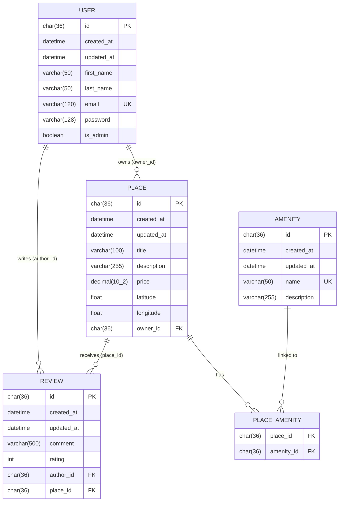
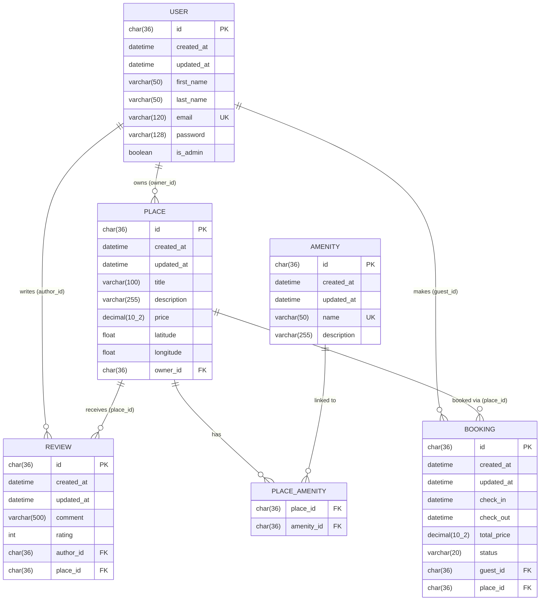

# Database Diagrams – Explanatory Notes

## Overview

This document presents the Entity-Relationship (ER) diagrams for the HBnB project database schema, generated using Mermaid.js. Two diagrams are provided: the **current implemented schema** and an **extended schema** that includes a potential `BOOKING` table for future development.

---

## Diagram 1 — Current Implemented Schema

This diagram reflects the actual database as implemented in the project. It covers the five core tables: `USER`, `PLACE`, `REVIEW`, `AMENITY`, and the `PLACE_AMENITY` junction table.

---

## Tables — Description

### USER
The central entity of the application. Each user can own multiple places and write multiple reviews. The `email` field carries a unique constraint to prevent duplicate accounts. Passwords are stored hashed (bcrypt). The `is_admin` flag controls access to privileged operations such as creating or deleting amenities.

| Field | Type | Constraint | Description |
|-------|------|------------|-------------|
| `id` | `char(36)` | PK | UUID generated at creation |
| `created_at` | `datetime` | — | Timestamp of creation |
| `updated_at` | `datetime` | — | Timestamp of last update |
| `first_name` | `varchar(50)` | required | User's first name |
| `last_name` | `varchar(50)` | required | User's last name |
| `email` | `varchar(120)` | UK | Must be unique and valid |
| `password` | `varchar(128)` | — | Bcrypt-hashed password |
| `is_admin` | `boolean` | — | Admin privilege flag |

---

### PLACE
Represents a rental listing created by a user (the owner). Each place stores its geographic coordinates and pricing. A place can have multiple reviews and be linked to multiple amenities through the `PLACE_AMENITY` junction table.

| Field | Type | Constraint | Description |
|-------|------|------------|-------------|
| `id` | `char(36)` | PK | UUID generated at creation |
| `created_at` | `datetime` | — | Timestamp of creation |
| `updated_at` | `datetime` | — | Timestamp of last update |
| `title` | `varchar(100)` | required | Name of the listing |
| `description` | `varchar(255)` | optional | Short description |
| `price` | `decimal(10,2)` | > 0 | Nightly price |
| `latitude` | `float` | -90 to 90 | Geographic latitude |
| `longitude` | `float` | -180 to 180 | Geographic longitude |
| `owner_id` | `char(36)` | FK → USER | Reference to the owner |

---

### REVIEW
Stores user feedback on a place. Each review is tied to one author and one place. Business rules enforce that a user cannot review their own place and cannot submit more than one review per place.

| Field | Type | Constraint | Description |
|-------|------|------------|-------------|
| `id` | `char(36)` | PK | UUID generated at creation |
| `created_at` | `datetime` | — | Timestamp of creation |
| `updated_at` | `datetime` | — | Timestamp of last update |
| `comment` | `varchar(500)` | required | Review text |
| `rating` | `int` | 1 to 5 | Numeric rating |
| `author_id` | `char(36)` | FK → USER | Reference to the reviewer |
| `place_id` | `char(36)` | FK → PLACE | Reference to the reviewed place |

---

### AMENITY
Represents a feature or service that can be associated with a place (e.g., WiFi, Swimming Pool). Names are stored in lowercase and must be unique. The description field is optional.

| Field | Type | Constraint | Description |
|-------|------|------------|-------------|
| `id` | `char(36)` | PK | UUID generated at creation |
| `created_at` | `datetime` | — | Timestamp of creation |
| `updated_at` | `datetime` | — | Timestamp of last update |
| `name` | `varchar(50)` | UK, lowercase | Unique amenity name |
| `description` | `varchar(255)` | optional | Short description |

---

### PLACE_AMENITY
A pure junction table implementing the many-to-many relationship between `PLACE` and `AMENITY`. It holds no additional data — only the two foreign keys that form a composite primary key.

| Field | Type | Constraint | Description |
|-------|------|------------|-------------|
| `place_id` | `char(36)` | FK → PLACE | Reference to the place |
| `amenity_id` | `char(36)` | FK → AMENITY | Reference to the amenity |

---

## Relationships — Summary

| Relationship | Type | Description |
|---|---|---|
| USER → PLACE | One-to-many | A user can own zero or more places |
| USER → REVIEW | One-to-many | A user can write zero or more reviews |
| PLACE → REVIEW | One-to-many | A place can receive zero or more reviews |
| PLACE ↔ AMENITY | Many-to-many | A place can have multiple amenities; an amenity can be linked to multiple places (via `PLACE_AMENITY`) |

---

## Diagram 2 — Extended Schema (with BOOKING)

This second diagram extends the current schema with a hypothetical `BOOKING` table, illustrating how the data model could evolve to support reservation management. The `BOOKING` table is **not implemented** in the current version of the project.

### BOOKING (hypothetical)
The `BOOKING` table would represent a reservation made by a guest (a `USER`) for a specific `PLACE`. It tracks check-in and check-out dates, total price at booking time, and a status field to manage the reservation lifecycle (e.g., `pending`, `confirmed`, `cancelled`).

| Field | Type | Constraint | Description |
|-------|------|------------|-------------|
| `id` | `char(36)` | PK | UUID generated at creation |
| `created_at` | `datetime` | — | Timestamp of creation |
| `updated_at` | `datetime` | — | Timestamp of last update |
| `check_in` | `datetime` | required | Start date of the stay |
| `check_out` | `datetime` | required | End date of the stay |
| `total_price` | `decimal(10,2)` | > 0 | Total price at booking time |
| `status` | `varchar(20)` | — | Booking status (pending / confirmed / cancelled) |
| `guest_id` | `char(36)` | FK → USER | Reference to the guest |
| `place_id` | `char(36)` | FK → PLACE | Reference to the booked place |

Adding `BOOKING` would introduce two new one-to-many relationships: a user can make multiple bookings, and a place can receive multiple bookings.

---

## Design Decisions

**UUIDs as primary keys** — All tables use `char(36)` UUIDs instead of auto-incremented integers. This avoids predictable IDs in the API and makes the schema portable across distributed systems.

**Shared base fields** — Every table except `PLACE_AMENITY` inherits `id`, `created_at`, and `updated_at` from a shared `BaseModel`, keeping the schema consistent and auditable.

**`PLACE_AMENITY` as a pure junction table** — The many-to-many relationship between places and amenities is resolved through a dedicated junction table with no extra columns, following standard normalization practices.

**Soft constraints enforced at the application layer** — Rules such as "a user cannot review their own place" or "only one review per user per place" are not enforced by SQL constraints but by the business logic in the facade layer.

---

## Author

**Gwenaelle PICHOT**  
Student at Holberton School  
Project: Holberton - HBNB